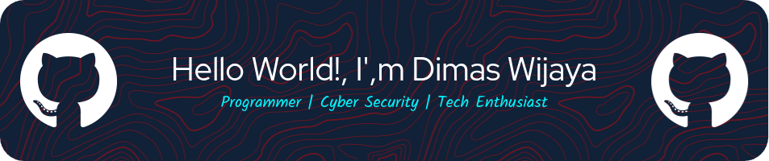

# 👋 Hi there, I'm Dimas Wijaya
### A passionate **Web Developer** & **Cyber Security Enthusiast** from Indonesia 🇮🇩

- 🔭 I’m currently working on: `About Cyber Security and Web Developer`
- 🌱 I’m currently learning: `Back-End Development, Front-End Development, Cyber security`
- 👯 I’m looking to collaborate on: `Open-source projects and industrial Project`
- 💬 Ask me about: `Linux`, `Web Dev`, `CyberSec`, `About Tech`
- 📫 How to reach me: `dimaswijay2345@example.com`

- ⚡ Fun fact: As a self-taught developer, I thrive at the intersection of frontend design, backend logic, system customization, and cyber security. I enjoy crafting user interfaces, building scalable backend solutions, optimizing Linux for performance, and understanding how systems can be secured — and exploited. I believe that mastering both creation and protection is key to becoming a well-rounded developer.

## WEB DEVELOPER !

## CYBER SECURITY !

  
  
  
  
  
  

#### 💻🔒 Where the **Code** meets **Security**

